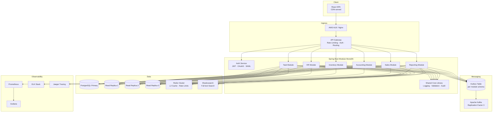
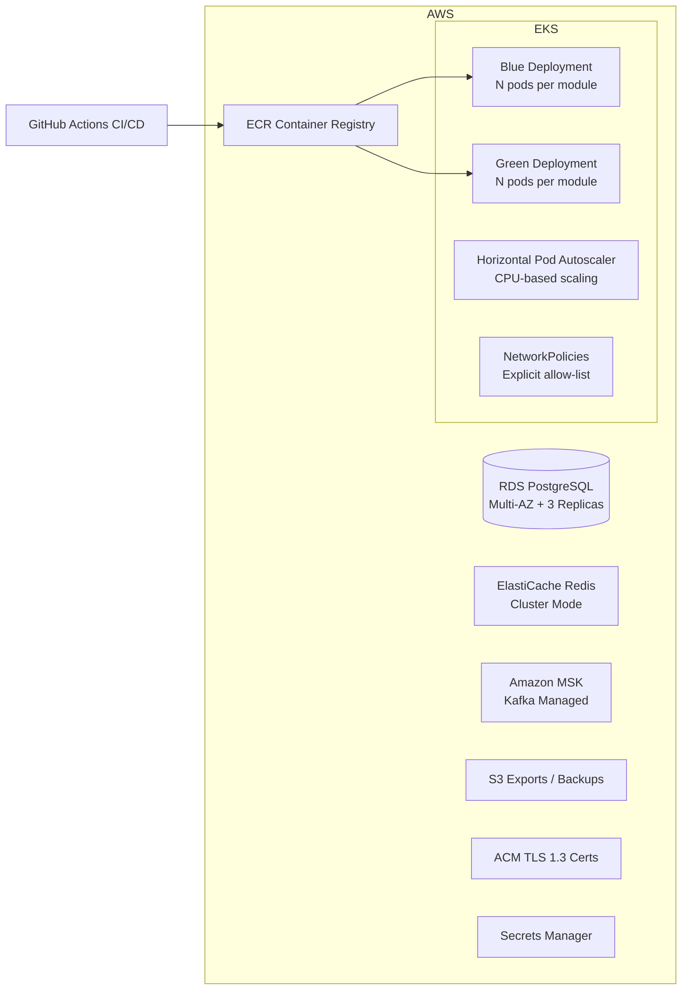
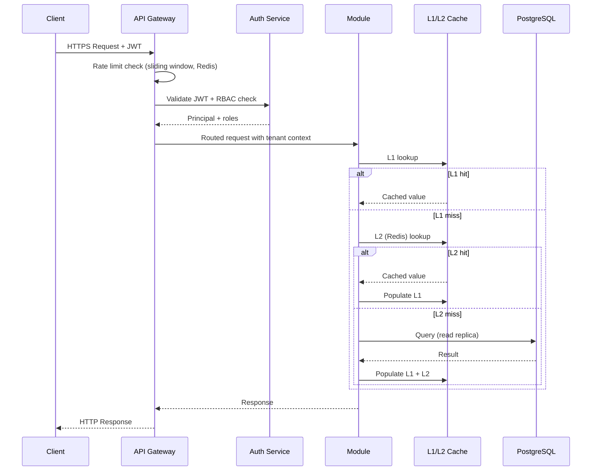

# Design Document: Flowdesk SaaS Platform

## Overview

Flowdesk Pro is a production-ready, multi-tenant SaaS platform built as a modular monolith. It combines a Trello-style task and project management core with five enterprise ERP modules: Human Resources, Inventory Management, Accounting & Finance, Sales & CRM, and Reporting & Analytics.

The platform is designed to serve 10,000+ concurrent users with P95 API latency under 100ms, 99.97% availability, and full compliance with GDPR, ISO 27001, and SOC2. The architecture prioritizes clean module boundaries, event-driven decoupling, and defense-in-depth security.

Key design decisions:
- **Modular monolith** over microservices: reduces operational complexity while preserving domain isolation via package boundaries and schema-per-module
- **Two-level cache** (Caffeine L1 + Redis L2): minimizes database load while tolerating Redis failures gracefully
- **Transactional outbox pattern**: guarantees atomicity between database writes and Kafka event publications
- **Schema-per-module isolation**: enforces tenant and module boundaries at the database level, not just application logic


## Architecture

### High-Level Architecture



### Deployment Architecture



### Request Flow




## Components and Interfaces

### API Gateway

Responsibilities: TLS termination, JWT validation, RBAC enforcement, rate limiting, request routing, OpenAPI spec serving.

```
GET/POST/PUT/DELETE /api/v1/{module}/{resource}
  Headers: Authorization: Bearer <jwt>
  Response: 200/201/204 on success
            401 - missing/invalid/expired JWT
            403 - insufficient role or cross-tenant access
            429 - rate limit exceeded (Retry-After header)
```

Rate limiting uses a sliding window counter stored in Redis with key `rate:{userId}` or `rate:ip:{ip}`. TTL equals the window duration (60 seconds).

### Auth Service

Responsibilities: Registration, login, JWT issuance/validation, refresh token management, OAuth2/SAML integration, password policy enforcement.

Key interfaces:
```
POST /api/v1/auth/register   { email, password } -> { jwt, expiresIn }
POST /api/v1/auth/login      { email, password } -> { jwt } + Set-Cookie: refreshToken (HttpOnly)
POST /api/v1/auth/refresh    Cookie: refreshToken -> { jwt }
POST /api/v1/auth/logout     -> 204
GET  /api/v1/auth/oauth2/callback  (OAuth2 provider redirect)
POST /api/v1/auth/saml/acs         (SAML assertion consumer)
```

JWT payload:
```json
{
  "sub": "userId",
  "tenantId": "tenantId",
  "roles": ["MEMBER"],
  "iat": 1700000000,
  "exp": 1700086400
}
```

### Task Module

```
POST   /api/v1/tasks/projects          Create project
GET    /api/v1/tasks/projects          List projects (tenant-scoped)
POST   /api/v1/tasks/projects/{id}/tasks   Create task
GET    /api/v1/tasks/projects/{id}/tasks   List tasks (tenant-scoped)
PUT    /api/v1/tasks/tasks/{id}        Update task
DELETE /api/v1/tasks/tasks/{id}        Soft-delete task
PUT    /api/v1/tasks/tasks/{id}/assign { assigneeId }
```

### HR Module

```
POST /api/v1/hr/employees              Create employee
PUT  /api/v1/hr/employees/{id}         Update employee
POST /api/v1/hr/attendance             Record attendance entry
POST /api/v1/hr/payroll/run            Initiate payroll run { payPeriodStart, payPeriodEnd }
GET  /api/v1/hr/payroll/{runId}/report Payroll report
POST /api/v1/hr/reviews                Submit performance review
```

### Inventory Module

```
POST /api/v1/inventory/skus            Create SKU
PUT  /api/v1/inventory/skus/{id}/stock Adjust stock quantity
POST /api/v1/inventory/purchase-orders Create PO
PUT  /api/v1/inventory/purchase-orders/{id}/receive  Receive PO
GET  /api/v1/inventory/warehouses      List warehouses
```

### Accounting Module

```
POST /api/v1/accounting/journal-entries   Post journal entry
GET  /api/v1/accounting/accounts/{id}/balance  Account balance
GET  /api/v1/accounting/reports/trial-balance  Trial balance
GET  /api/v1/accounting/reports/income-statement
GET  /api/v1/accounting/reports/balance-sheet
POST /api/v1/accounting/ap/invoices       Create AP invoice
POST /api/v1/accounting/ar/invoices       Create AR invoice
```

### Sales Module

```
POST /api/v1/sales/customers              Create customer
POST /api/v1/sales/opportunities          Create opportunity
PUT  /api/v1/sales/opportunities/{id}     Update stage
POST /api/v1/sales/orders                 Create sales order
PUT  /api/v1/sales/orders/{id}/confirm    Confirm order
POST /api/v1/sales/orders/{id}/invoice    Generate invoice
POST /api/v1/sales/interactions           Record customer interaction
```

### Reporting Module

```
GET  /api/v1/reporting/dashboards/{module}   Pre-built dashboard metrics
POST /api/v1/reporting/reports               Define custom report
POST /api/v1/reporting/reports/{id}/execute  Execute report
GET  /api/v1/reporting/reports/{id}/export   Export (CSV/XLSX)
GET  /api/v1/reporting/search?q=...          Full-text search via Elasticsearch
```

### Event Bus (Kafka Topics)

| Topic | Producer | Consumer(s) | Schema |
|---|---|---|---|
| `hr.employee.changed` | HR Module | Reporting, Audit | EmployeeChangedEvent |
| `hr.review.submitted` | HR Module | Notification Service | ReviewSubmittedEvent |
| `inventory.low-stock` | Inventory Module | Purchasing, Reporting | LowStockEvent |
| `sales.order.confirmed` | Sales Module | Inventory Module | OrderConfirmedEvent |
| `sales.credit-hold` | Sales Module | Finance Team | CreditHoldEvent |
| `accounting.invoice.overdue` | Accounting Module | Collections | InvoiceOverdueEvent |
| `audit.events` | All Modules | Audit Log Writer | AuditEvent |
| `{consumer}.dlq` | Kafka (retry) | Ops/Alerting | Original event |

All topics use replication factor 3, min.insync.replicas=2.


## Data Models

### Multi-Tenancy

Every business entity table includes a `tenant_id UUID NOT NULL` column. The application layer injects the tenant ID from the JWT into every query. Schema-per-module isolation means each module owns its own PostgreSQL schema (e.g., `task_schema`, `hr_schema`, `inventory_schema`, `accounting_schema`, `sales_schema`, `reporting_schema`), with a shared `core_schema` for cross-cutting tables.

### Core Schema

```sql
-- core_schema.tenants
CREATE TABLE core_schema.tenants (
    id          UUID PRIMARY KEY DEFAULT gen_random_uuid(),
    name        VARCHAR(255) NOT NULL,
    created_at  TIMESTAMPTZ NOT NULL DEFAULT now()
);

-- core_schema.users
CREATE TABLE core_schema.users (
    id              UUID PRIMARY KEY DEFAULT gen_random_uuid(),
    tenant_id       UUID NOT NULL REFERENCES core_schema.tenants(id),
    email           VARCHAR(255) NOT NULL UNIQUE,
    password_hash   VARCHAR(255) NOT NULL,  -- bcrypt, cost >= 12
    roles           TEXT[] NOT NULL DEFAULT '{}',
    created_at      TIMESTAMPTZ NOT NULL DEFAULT now(),
    updated_at      TIMESTAMPTZ NOT NULL DEFAULT now()
);

-- core_schema.audit_log (append-only, partitioned by month)
CREATE TABLE core_schema.audit_log (
    id              UUID NOT NULL DEFAULT gen_random_uuid(),
    tenant_id       UUID NOT NULL,
    actor_id        UUID NOT NULL,
    action          VARCHAR(50) NOT NULL,   -- CREATE, UPDATE, DELETE
    entity_type     VARCHAR(100) NOT NULL,
    entity_id       UUID NOT NULL,
    timestamp       TIMESTAMPTZ NOT NULL DEFAULT now(),
    before_snapshot JSONB,
    after_snapshot  JSONB
) PARTITION BY RANGE (timestamp);
-- Revoke UPDATE/DELETE on audit_log for all roles
```

### Task Schema

```sql
CREATE TABLE task_schema.projects (
    id          UUID PRIMARY KEY DEFAULT gen_random_uuid(),
    tenant_id   UUID NOT NULL,
    name        VARCHAR(255) NOT NULL,
    description TEXT,
    owner_id    UUID NOT NULL,
    created_at  TIMESTAMPTZ NOT NULL DEFAULT now(),
    deleted_at  TIMESTAMPTZ  -- soft delete
);

CREATE TABLE task_schema.tasks (
    id          UUID PRIMARY KEY DEFAULT gen_random_uuid(),
    tenant_id   UUID NOT NULL,
    project_id  UUID NOT NULL REFERENCES task_schema.projects(id),
    title       VARCHAR(500) NOT NULL,
    description TEXT,
    status      VARCHAR(20) NOT NULL DEFAULT 'TODO'
                CHECK (status IN ('TODO','IN_PROGRESS','REVIEW','DONE')),
    assignee_id UUID,
    owner_id    UUID NOT NULL,
    created_at  TIMESTAMPTZ NOT NULL DEFAULT now(),
    updated_at  TIMESTAMPTZ NOT NULL DEFAULT now(),
    deleted_at  TIMESTAMPTZ
);
CREATE INDEX idx_tasks_tenant_project ON task_schema.tasks(tenant_id, project_id) WHERE deleted_at IS NULL;
```

### HR Schema

```sql
CREATE TABLE hr_schema.employees (
    id                  UUID PRIMARY KEY DEFAULT gen_random_uuid(),
    tenant_id           UUID NOT NULL,
    full_name           VARCHAR(255) NOT NULL,
    department          VARCHAR(100),
    job_title           VARCHAR(100),
    employment_status   VARCHAR(20) NOT NULL DEFAULT 'ACTIVE',
    start_date          DATE NOT NULL,
    base_salary         NUMERIC(15,2),
    currency            CHAR(3),
    created_at          TIMESTAMPTZ NOT NULL DEFAULT now(),
    updated_at          TIMESTAMPTZ NOT NULL DEFAULT now()
);

-- Partitioned by month for high volume
CREATE TABLE hr_schema.attendance (
    id              UUID NOT NULL DEFAULT gen_random_uuid(),
    tenant_id       UUID NOT NULL,
    employee_id     UUID NOT NULL,
    date            DATE NOT NULL,
    check_in        TIMESTAMPTZ,
    check_out       TIMESTAMPTZ,
    status          VARCHAR(20) NOT NULL CHECK (status IN ('PRESENT','ABSENT','LATE','ON_LEAVE'))
) PARTITION BY RANGE (date);

CREATE TABLE hr_schema.performance_reviews (
    id              UUID PRIMARY KEY DEFAULT gen_random_uuid(),
    tenant_id       UUID NOT NULL,
    employee_id     UUID NOT NULL,
    reviewer_id     UUID NOT NULL,
    review_period   VARCHAR(20) NOT NULL,
    rating          NUMERIC(3,1) NOT NULL,
    submitted_at    TIMESTAMPTZ NOT NULL DEFAULT now()
);
```

### Inventory Schema

```sql
CREATE TABLE inventory_schema.skus (
    id                  UUID PRIMARY KEY DEFAULT gen_random_uuid(),
    tenant_id           UUID NOT NULL,
    product_name        VARCHAR(255) NOT NULL,
    reorder_threshold   INT NOT NULL DEFAULT 0,
    unit_cost           NUMERIC(15,4) NOT NULL,
    created_at          TIMESTAMPTZ NOT NULL DEFAULT now()
);

CREATE TABLE inventory_schema.stock (
    id              UUID PRIMARY KEY DEFAULT gen_random_uuid(),
    tenant_id       UUID NOT NULL,
    sku_id          UUID NOT NULL REFERENCES inventory_schema.skus(id),
    warehouse_id    UUID NOT NULL,
    quantity_on_hand INT NOT NULL DEFAULT 0,
    updated_at      TIMESTAMPTZ NOT NULL DEFAULT now(),
    UNIQUE (sku_id, warehouse_id)
);

CREATE TABLE inventory_schema.purchase_orders (
    id          UUID PRIMARY KEY DEFAULT gen_random_uuid(),
    tenant_id   UUID NOT NULL,
    supplier_id UUID NOT NULL,
    status      VARCHAR(20) NOT NULL DEFAULT 'DRAFT'
                CHECK (status IN ('DRAFT','SUBMITTED','APPROVED','RECEIVED','CANCELLED')),
    created_at  TIMESTAMPTZ NOT NULL DEFAULT now()
);

CREATE TABLE inventory_schema.po_line_items (
    id          UUID PRIMARY KEY DEFAULT gen_random_uuid(),
    po_id       UUID NOT NULL REFERENCES inventory_schema.purchase_orders(id),
    sku_id      UUID NOT NULL,
    quantity    INT NOT NULL,
    unit_cost   NUMERIC(15,4) NOT NULL
);
```

### Accounting Schema

```sql
CREATE TABLE accounting_schema.accounts (
    id          UUID PRIMARY KEY DEFAULT gen_random_uuid(),
    tenant_id   UUID NOT NULL,
    code        VARCHAR(20) NOT NULL,
    name        VARCHAR(255) NOT NULL,
    type        VARCHAR(20) NOT NULL,  -- ASSET, LIABILITY, EQUITY, REVENUE, EXPENSE
    balance     NUMERIC(20,4) NOT NULL DEFAULT 0,
    UNIQUE (tenant_id, code)
);

-- Partitioned by month
CREATE TABLE accounting_schema.journal_entries (
    id              UUID NOT NULL DEFAULT gen_random_uuid(),
    tenant_id       UUID NOT NULL,
    description     VARCHAR(500),
    posted_at       TIMESTAMPTZ NOT NULL DEFAULT now(),
    posted_by       UUID NOT NULL
) PARTITION BY RANGE (posted_at);

CREATE TABLE accounting_schema.journal_lines (
    id              UUID PRIMARY KEY DEFAULT gen_random_uuid(),
    entry_id        UUID NOT NULL,
    account_id      UUID NOT NULL,
    amount          NUMERIC(20,4) NOT NULL,  -- positive = debit, negative = credit
    description     VARCHAR(255)
);
-- Invariant: SUM(amount) per entry_id = 0
```

### Sales Schema

```sql
CREATE TABLE sales_schema.customers (
    id              UUID PRIMARY KEY DEFAULT gen_random_uuid(),
    tenant_id       UUID NOT NULL,
    company_name    VARCHAR(255) NOT NULL,
    contact_email   VARCHAR(255),
    credit_limit    NUMERIC(15,2) NOT NULL DEFAULT 0,
    payment_terms   VARCHAR(50),
    created_at      TIMESTAMPTZ NOT NULL DEFAULT now()
);

CREATE TABLE sales_schema.opportunities (
    id          UUID PRIMARY KEY DEFAULT gen_random_uuid(),
    tenant_id   UUID NOT NULL,
    customer_id UUID NOT NULL,
    stage       VARCHAR(20) NOT NULL DEFAULT 'PROSPECT'
                CHECK (stage IN ('PROSPECT','QUALIFIED','PROPOSAL','NEGOTIATION','CLOSED_WON','CLOSED_LOST')),
    value       NUMERIC(15,2),
    updated_at  TIMESTAMPTZ NOT NULL DEFAULT now()
);

CREATE TABLE sales_schema.orders (
    id              UUID PRIMARY KEY DEFAULT gen_random_uuid(),
    tenant_id       UUID NOT NULL,
    customer_id     UUID NOT NULL,
    opportunity_id  UUID,
    status          VARCHAR(20) NOT NULL DEFAULT 'DRAFT'
                    CHECK (status IN ('DRAFT','CONFIRMED','FULFILLED','INVOICED','CANCELLED')),
    credit_hold     BOOLEAN NOT NULL DEFAULT FALSE,
    created_at      TIMESTAMPTZ NOT NULL DEFAULT now()
);
```

### Transactional Outbox

Each module schema contains its own outbox table to ensure atomicity:

```sql
CREATE TABLE {module}_schema.outbox_events (
    id              UUID PRIMARY KEY DEFAULT gen_random_uuid(),
    aggregate_type  VARCHAR(100) NOT NULL,
    aggregate_id    UUID NOT NULL,
    event_type      VARCHAR(100) NOT NULL,
    payload         JSONB NOT NULL,
    created_at      TIMESTAMPTZ NOT NULL DEFAULT now(),
    published_at    TIMESTAMPTZ,
    retry_count     INT NOT NULL DEFAULT 0
);
-- A background relay process polls unpublished rows and publishes to Kafka,
-- then marks published_at. Runs within the same DB transaction as the business write.
```


## Correctness Properties

*A property is a characteristic or behavior that should hold true across all valid executions of a system — essentially, a formal statement about what the system should do. Properties serve as the bridge between human-readable specifications and machine-verifiable correctness guarantees.*

**Property Reflection:** After reviewing all prework-identified properties, the following consolidations were made:
- Requirements 2.5 and 2.6 (RBAC enforcement on every endpoint) are merged into Property 4 — one comprehensive RBAC property covers both.
- Requirements 10.1 and 10.3 (rate limit + 429 response) are merged into Property 10 — the 429 with Retry-After is the observable outcome of the rate limit.
- Requirements 1.3 and 1.4 (expired JWT rejection, duplicate email) are edge cases covered by the generators in Properties 1 and 2 respectively.
- Requirements 3.1 and 3.2 (project/task creation round-trips) are merged into Property 5 — one round-trip property covers both resource types.

---

### Property 1: Registration produces a valid JWT for any valid credential

*For any* valid email address and password meeting minimum entropy requirements, submitting a registration request SHALL result in a signed JWT being returned with a 24-hour expiry, and the stored password SHALL be a bcrypt hash with cost factor >= 12 (never the plaintext password).

**Validates: Requirements 1.1, 1.7**

---

### Property 2: Login is a round-trip of registration

*For any* successfully registered user, submitting their credentials to the login endpoint SHALL return a valid JWT and set an HTTP-only refresh token cookie; submitting an incorrect password for the same email SHALL return HTTP 401 with the same error message regardless of which field is wrong.

**Validates: Requirements 1.2, 1.5**

---

### Property 3: Refresh token issues a new JWT

*For any* valid refresh token issued during login, submitting it to the refresh endpoint SHALL return a new valid JWT without requiring re-authentication.

**Validates: Requirements 1.6**

---

### Property 4: RBAC enforcement is universal across all protected endpoints

*For any* protected API endpoint and any authenticated user whose role does not include the required permission for that endpoint, the request SHALL be rejected with HTTP 403. *For any* write operation attempted by a user with the VIEWER role, the request SHALL be rejected with HTTP 403.

**Validates: Requirements 2.2, 2.5, 2.6**

---

### Property 5: Resource creation is a round-trip

*For any* valid project or task creation request submitted by an authorized member, the created resource SHALL be persisted and the returned resource SHALL contain all submitted fields with an assigned ID and HTTP 201 status.

**Validates: Requirements 3.1, 3.2**

---

### Property 6: Task updates are reflected in subsequent reads

*For any* existing task and any valid set of field updates, submitting an update request SHALL result in the task's fields matching the submitted values when subsequently retrieved.

**Validates: Requirements 3.3**

---

### Property 7: Tenant isolation — queries never return cross-tenant data

*For any* database query executed by any module, the results SHALL contain only resources belonging to the requesting user's tenant. *For any* attempt to access a resource belonging to a different tenant, the response SHALL be HTTP 403 without revealing the resource's existence.

**Validates: Requirements 3.5, 19.2, 19.3**

---

### Property 8: Cross-tenant assignment is rejected

*For any* task assignment request where the assignee belongs to a different tenant than the task, the request SHALL be rejected with a descriptive error.

**Validates: Requirements 3.7**

---

### Property 9: Double-entry ledger invariant

*For any* journal entry submitted to the Accounting module, the sum of all line amounts SHALL equal zero (debits equal credits). *For any* journal entry where this invariant is violated, the entry SHALL be rejected with a validation error specifying the imbalance amount.

**Validates: Requirements 7.1, 7.3**

---

### Property 10: Rate limiting enforces sliding window with correct HTTP response

*For any* authenticated user who submits more than 100 requests within any 60-second sliding window, all requests beyond the limit SHALL receive HTTP 429 with a `Retry-After` header. The sliding window algorithm SHALL correctly count requests at window boundaries.

**Validates: Requirements 10.1, 10.3, 10.4**

---

### Property 11: Cache lookup order is L1 → L2 → database

*For any* cache read operation, the system SHALL check L1 (Caffeine) first, then L2 (Redis), and only query the database on a complete miss. When Redis is unavailable, the system SHALL serve from L1 without returning an error to the caller.

**Validates: Requirements 11.3, 11.5**

---

### Property 12: Cache invalidation is consistent after writes

*For any* business entity update, the corresponding L1 and L2 cache entries SHALL be invalidated within 1 second of the transaction commit, such that subsequent reads reflect the updated state.

**Validates: Requirements 11.4**

---

### Property 13: Dead-letter routing after exhausted retries

*For any* Kafka message that fails processing on every attempt across 3 retries, the message SHALL be routed to the dead-letter topic for that consumer group and SHALL NOT be redelivered to the main topic.

**Validates: Requirements 12.3**

---

### Property 14: Transactional outbox atomicity

*For any* operation that writes to the database and publishes an event, either both the database write and the outbox entry are committed, or neither is — ensuring no event is lost on application crash and no event is published for a rolled-back transaction.

**Validates: Requirements 12.5**

---

### Property 15: Audit log completeness and immutability

*For any* create, update, or delete operation on any business entity, an audit log entry SHALL be created containing: actor identity, action type, entity type, entity ID, timestamp, and before/after snapshots. *For any* attempt to modify or delete an existing audit log entry, the operation SHALL be rejected.

**Validates: Requirements 13.3, 13.4**

---

### Property 16: Password hashing is irreversible

*For any* password submitted during registration, the value stored in the database SHALL be a bcrypt hash (never plaintext), and the hash SHALL verify correctly against the original password using bcrypt comparison.

**Validates: Requirements 1.7**

---

### Property 17: Sales credit hold is applied for any order exceeding credit limit

*For any* sales order where the customer's outstanding balance plus the order value exceeds the customer's credit limit, the order SHALL be placed on credit hold and a notification event SHALL be published to the Event_Bus.

**Validates: Requirements 8.7**

---

### Property 18: Opportunity closed-won triggers order creation

*For any* sales opportunity transitioned to the CLOSED_WON stage, a linked sales order SHALL be automatically created within 5 seconds.

**Validates: Requirements 8.3**

---

### Property 19: Low-stock events are published for any threshold-crossing transaction

*For any* stock quantity update that results in quantity on hand being at or below the reorder threshold, a low-stock event SHALL be published to the Event_Bus within 1 minute of the triggering transaction.

**Validates: Requirements 6.2**

---

### Property 20: Payroll calculation correctness

*For any* set of active employees with complete compensation data, a payroll run SHALL produce gross pay, statutory deductions, and net pay where net pay equals gross pay minus total deductions for every employee in the run.

**Validates: Requirements 5.4**


## Error Handling

### Global Exception Handling

A `@ControllerAdvice` in the shared core library maps all exceptions to a consistent error envelope:

```json
{
  "timestamp": "2024-01-15T10:30:00Z",
  "status": 400,
  "error": "Bad Request",
  "message": "Descriptive message for the caller",
  "traceId": "abc123def456",
  "path": "/api/v1/tasks/projects"
}
```

| Exception Type | HTTP Status | Notes |
|---|---|---|
| `ValidationException` | 400 | Field-level validation failures |
| `AuthenticationException` | 401 | Missing/invalid/expired JWT |
| `AccessDeniedException` | 403 | RBAC failure or cross-tenant access |
| `ResourceNotFoundException` | 404 | Entity not found (tenant-aware: never reveals cross-tenant existence) |
| `ConflictException` | 409 | Duplicate resource (e.g., email already registered) |
| `RateLimitExceededException` | 429 | Includes `Retry-After` header |
| `BusinessRuleException` | 422 | Domain rule violations (e.g., imbalanced journal entry) |
| `ServiceUnavailableException` | 503 | Dependency health check failure |
| Unhandled `Exception` | 500 | Stack trace captured by Jaeger, never exposed to client |

### Module-Level Error Handling

**Auth Service:**
- Invalid credentials always return the same message ("Invalid credentials") regardless of which field is wrong, preventing user enumeration.
- Expired JWTs return 401 with `WWW-Authenticate: Bearer error="invalid_token"`.

**Task Module:**
- Task creation with non-existent project ID returns 404 with message "Project not found".
- Cross-tenant assignment returns 422 with message "Assignee does not belong to this tenant".

**Accounting Module:**
- Imbalanced journal entry returns 422 with the imbalance amount: "Journal entry imbalanced by {amount}".
- Account balance updates use `SELECT FOR UPDATE` to prevent concurrent modification.

**Inventory Module:**
- PO with non-existent SKU rejects the entire order (not partial): "SKU {id} not found; order rejected".
- Stock updates use optimistic locking (`version` column) to prevent lost updates.

**Kafka / Event Bus:**
- Producers use idempotent producer config (`enable.idempotence=true`) to prevent duplicate events.
- Consumers implement exponential backoff: 1s, 2s, 4s before routing to DLQ.
- DLQ messages include original topic, partition, offset, and failure reason in headers.

**Cache:**
- Redis connection failures are caught and logged at WARN level; the request falls through to L1 or database.
- Cache stampede prevention: use probabilistic early expiration (PER) for high-traffic keys.

**Database:**
- All write operations use explicit transactions with `@Transactional`.
- Slow query logging triggers at 20ms (logged with query text, parameters, and execution plan).
- Connection pool exhaustion returns 503 after a configurable wait timeout (default 30s).


## Testing Strategy

### Overview

The testing strategy uses a dual approach: property-based tests for universal correctness guarantees and unit/integration tests for specific examples, edge cases, and infrastructure wiring.

### Property-Based Testing

**Library:** [jqwik](https://jqwik.net/) for Java (Spring Boot compatible, JUnit 5 integration).

Each property test runs a minimum of **100 iterations** with randomized inputs. Tests are tagged with the design property they validate.

Tag format: `@Tag("Feature: saas-platform, Property {N}: {property_text}")`

**Properties to implement as automated tests:**

| Property | Test Class | Key Generators |
|---|---|---|
| P1: Registration JWT | `AuthPropertyTest` | `@ForAll @Email String email`, `@ForAll @StringLength(min=8) String password` |
| P2: Login round-trip | `AuthPropertyTest` | Registered user generator |
| P3: Refresh token | `AuthPropertyTest` | Valid session generator |
| P4: RBAC universal | `RbacPropertyTest` | Endpoint × Role matrix generator |
| P5: Resource creation round-trip | `TaskPropertyTest` | Random project/task data generator |
| P6: Task update round-trip | `TaskPropertyTest` | Existing task + random field updates |
| P7: Tenant isolation | `TenantIsolationPropertyTest` | Multi-tenant resource generator |
| P8: Cross-tenant assignment | `TaskPropertyTest` | Cross-tenant user pair generator |
| P9: Double-entry invariant | `AccountingPropertyTest` | Random balanced/imbalanced entry generator |
| P10: Rate limiting | `RateLimitPropertyTest` | Request burst generator |
| P11: Cache lookup order | `CachePropertyTest` | Mock L1/L2/DB with hit/miss scenarios |
| P12: Cache invalidation | `CachePropertyTest` | Entity update + cache state verifier |
| P13: DLQ routing | `KafkaPropertyTest` | Failing consumer simulator |
| P14: Outbox atomicity | `OutboxPropertyTest` | Crash simulation at commit boundary |
| P15: Audit log completeness | `AuditPropertyTest` | Random CRUD operations across all modules |
| P16: Password hashing | `AuthPropertyTest` | Arbitrary password strings |
| P17: Credit hold | `SalesPropertyTest` | Customer credit limit + order value generator |
| P18: Closed-won order creation | `SalesPropertyTest` | Opportunity stage transition generator |
| P19: Low-stock events | `InventoryPropertyTest` | Stock quantity + threshold generator |
| P20: Payroll calculation | `HrPropertyTest` | Employee compensation data generator |

Example property test structure:

```java
@Tag("Feature: saas-platform, Property 9: Double-entry ledger invariant")
@Property(tries = 200)
void journalEntryMustBalance(@ForAll("validJournalEntries") JournalEntryRequest entry) {
    // For any valid journal entry, sum of lines must be zero
    BigDecimal sum = entry.getLines().stream()
        .map(JournalLine::getAmount)
        .reduce(BigDecimal.ZERO, BigDecimal::add);
    assertThat(sum).isEqualByComparingTo(BigDecimal.ZERO);
    
    // Posting should succeed
    ResponseEntity<JournalEntryResponse> response = accountingClient.postEntry(entry);
    assertThat(response.getStatusCode()).isEqualTo(HttpStatus.CREATED);
}

@Tag("Feature: saas-platform, Property 9: Double-entry ledger invariant")
@Property(tries = 200)
void imbalancedJournalEntryIsRejected(@ForAll("imbalancedJournalEntries") JournalEntryRequest entry) {
    ResponseEntity<ErrorResponse> response = accountingClient.postEntry(entry);
    assertThat(response.getStatusCode()).isEqualTo(HttpStatus.UNPROCESSABLE_ENTITY);
    assertThat(response.getBody().getMessage()).contains("imbalanced");
}
```

### Unit Tests

Focus on specific examples, edge cases, and pure business logic:

- Auth: expired token rejection, duplicate email 409, NIST password policy edge cases (minimum length, breach detection)
- Task: non-existent project ID returns 404, soft-delete visibility
- Inventory: PO with non-existent SKU rejects entire order
- Accounting: trial balance, income statement, balance sheet generation for known datasets
- Sales: invoice generation from fulfilled order with correct line items
- Reporting: RBAC filtering on report results

### Integration Tests

For infrastructure wiring and external service behavior (1-3 examples each):

- Database routing: verify read queries use replica connections, write queries use primary
- Kafka: end-to-end event publication and consumption with embedded Kafka (Testcontainers)
- Redis: cache hit/miss behavior with real Redis (Testcontainers)
- Elasticsearch: full-text search indexing and query
- Outbox relay: verify events are published after DB commit and not published on rollback
- Multi-region failover: RTO <= 15 minutes (staging environment test)

### Smoke Tests

One-time configuration and setup verification:

- All required roles exist with correct permissions
- OAuth2/SAML endpoints are configured and reachable
- TLS 1.3 is enforced (TLS 1.2 connections rejected)
- Secrets are loaded from Secrets Manager (not hardcoded)
- All Kafka topics exist with replication factor >= 3
- CloudWatch/Prometheus metrics endpoint is reachable

### Performance Tests (JMeter / Gatling)

Run against staging environment in CI/CD pipeline:

- P95 API latency < 100ms at 10,000 concurrent users
- Throughput >= 500 TPS sustained
- P95 database query time < 20ms
- Cache hit rate > 80% under steady-state load
- Horizontal scaling within 3 minutes when CPU > threshold

### Security Tests (SAST/DAST)

- SAST: run on every PR via GitHub Actions (e.g., Semgrep, SpotBugs)
- DAST: run against staging on every main branch merge (e.g., OWASP ZAP)
- Block deployment on any critical or high severity finding

### Frontend Tests

- Unit tests: React Testing Library for component behavior
- Snapshot tests: verify UI rendering for key components
- E2E tests: Playwright for critical user flows (login, task creation, dashboard)
- Performance: Lighthouse CI for LCP < 2.5s, bundle size < 200KB gzipped per route

